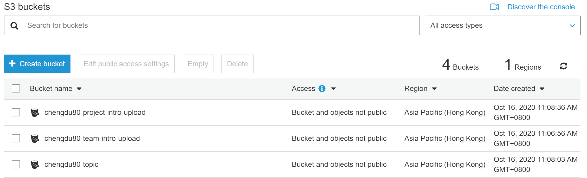
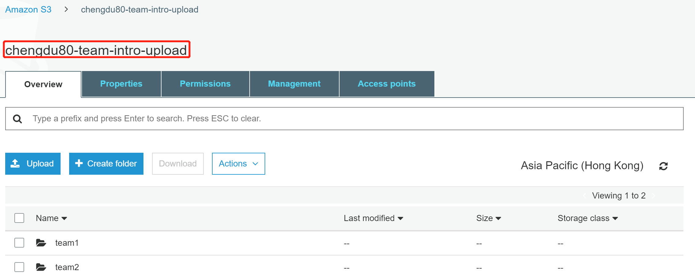
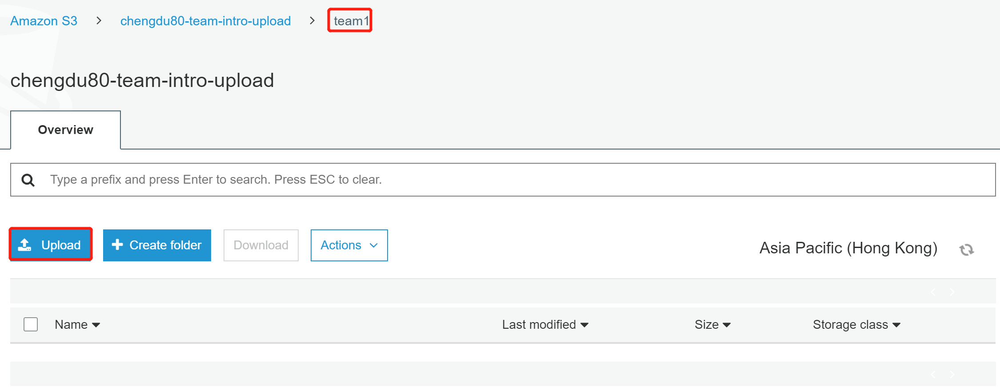
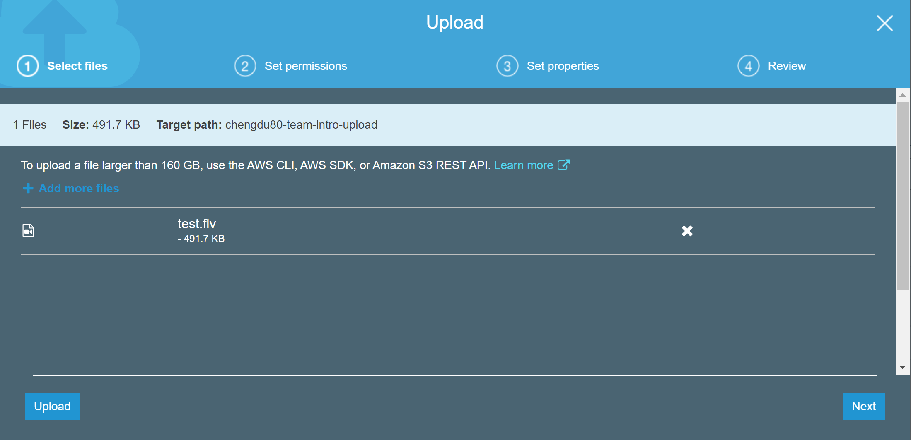
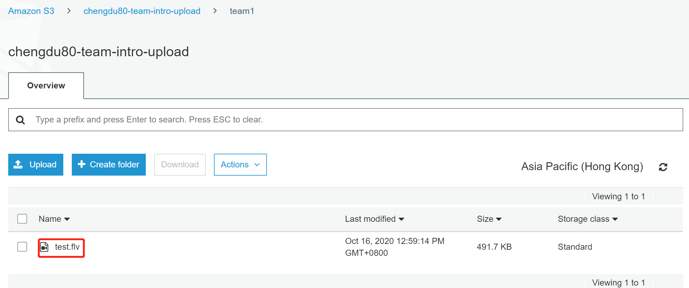

# Intro Product Video Upload

Using S3 to upload your team intro video and  contest project video.

## Uploading the Intro Video to a bucket 

**Turn to Amazon S3 managerment Console**

a.In the **Bucket** list, choose the name of the bucket that you want to upload your object to.

b.On the **Overview** tab for your bucket, choose **your team folder**.

c.To choose the file to upload, in the **Upload** dialog box, choose **Add files**.

d.Choose a file to upload, and then choose **Open.**

e.Choose **Upload**.

You've successfully uploaded an object to your bucket.

