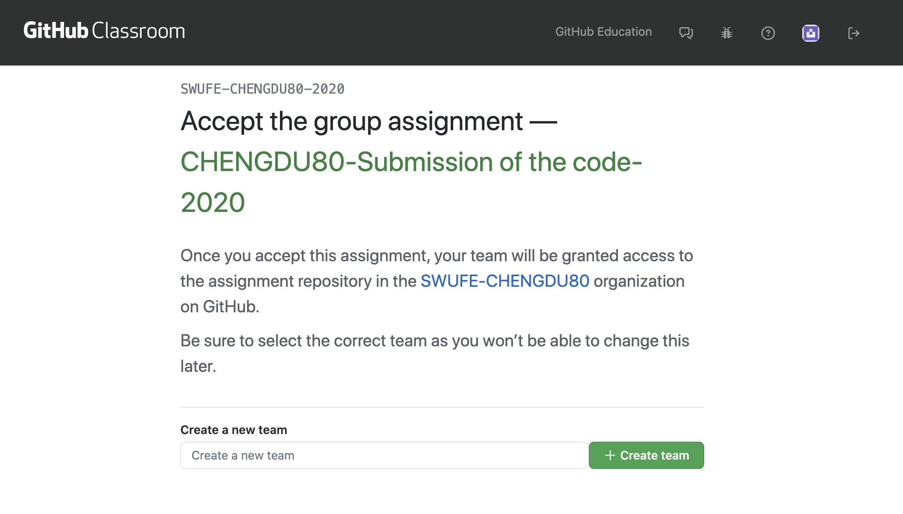

# Code Submission

We use Github Classroom to collect, store, review, and publish team codes after the tournament \(if you disagree about whether to publish your code, please contact the organizing committee with an instruction form\).

Here's the submission process \(as if you were submitting code to github normally\)

* [Sign in](https://classroom.github.com/login) your github account, or [sign up](https://github.com/join) for one if you don't have one .
* Click on the [link](https://classroom.github.com/g/ynLA-QII%20) to join and accept this assignment set by the chengdu80 contest .

* You need create a team ,name it after your university .
* The rest of your team can also join this code repository by following the [link](https://classroom.github.com/g/ynLA-QII%20) in step 2, while opting to join the team named after the university you created. This way, your team can work together to submit code to your repository!


Detailed instructions are available on the [github website](https://docs.github.com/en/free-pro-team@latest/github/getting-started-with-github). 


