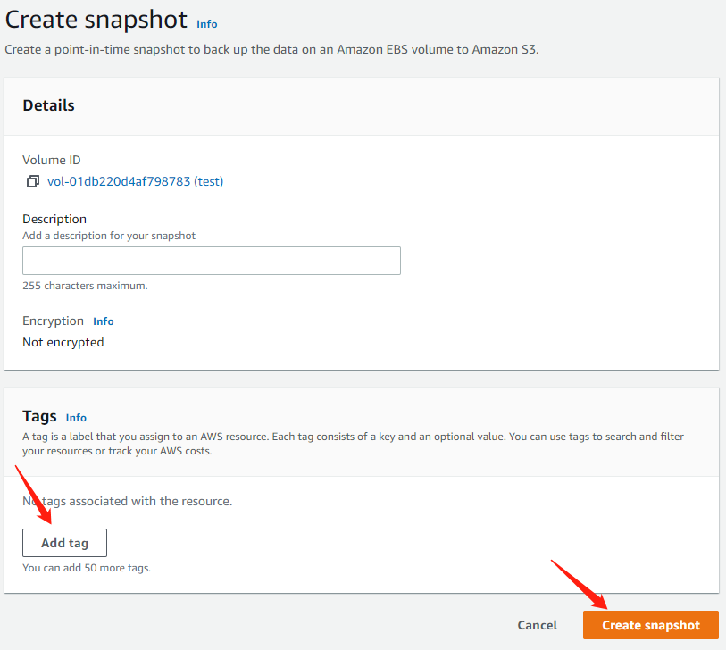

# Backup and Restore

When we encounter misoperation, we can use snapshot restore. We provide daily automatic snapshot at UTC 2:00 and provide self-manual snapshot.

## Creating a snapshot <a href="#ebs-create-snapshot" id="ebs-create-snapshot"></a>

Use the following procedure to create a snapshot from the specified volume.

### **1.To create a snapshot using the console.**

1.1 Open the Amazon EC2 console at [https://console.aws.amazon.com/ec2/](https://console.aws.amazon.com/ec2/).

1.2 Choose **Volume** under **Elastic Block Store** in the navigation pane.

1.3 Choose **Create Snapshot**.

<figure><figcaption></figcaption></figure>

1.4 Choose **Add Tag** to add tags to your snapshot. For each tag, provide a tag key and a tag value（Name\_account is your AccountName like chengdu80final-team 1）.

1.5 Choose **Create Snapshot**.

| Key   | Value         |
| ----- | ------------- |
| Name  | XXXX          |
| Owner | Name\_account |



### **2.(Optional)To create a snapshot using the command line, see the following example.**

* create-snapshot (AWS CLI):aws ec2 create-snapshots \\

```
    --instance-specification InstanceId=i-1234567890abcdef0 \
    --description "This is snapshot of a volume from my-instance"
```

* New-EC2Snapshot (AWS Tools for Windows PowerShell):

```
PS C:\> New-EC2Snapshot -VolumeId vol-12345678 -Description "This is a test"

DataEncryptionKeyId :
Description         : This is a test
Encrypted           : False
KmsKeyId            :
OwnerAlias          :
OwnerId             : 123456789012
Progress            :
SnapshotId          : snap-12345678
StartTime           : 12/22/2015 1:28:42 AM
State               : pending
StateMessage        :
Tags                : {}
VolumeId            : vol-12345678
VolumeSize          : 20This example creates a snapshot of the specified volume.
```

## Restoring a snapshot <a href="#ebs-create-snapshot" id="ebs-create-snapshot"></a>


Warning: Due to IAM limit，Contestants do not have permission to restore the snapshot.You just can[ contact us](../../tech-support/online-support.md) for alternative operations.


****

