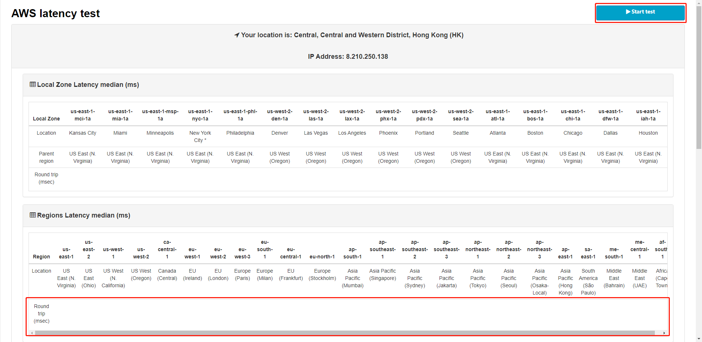
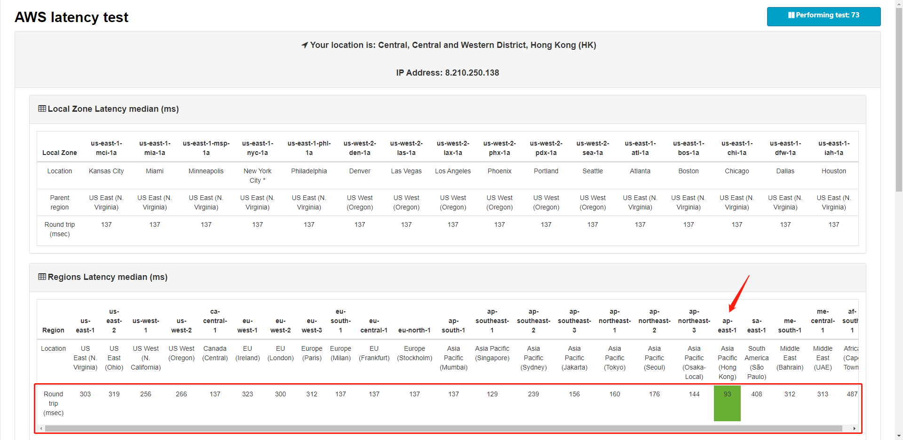

# Choose your fastest region

### 1.Click AWS latency test link:  [https://ping.psa.fun/](https://ping.psa.fun/)


We suggest that you use the Chrome browser to open the link. If this link does not work,  please[ contact us](../../tech-support/online-support.md).


### 2.Click this "start test" button

<figure><figcaption></figcaption></figure>

### 3.Then wait patiently for a few minutes. The "Latency (ms)" column will show the delay time of access to all area, The fastest areas are shown in green.

<figure><figcaption></figcaption></figure>

