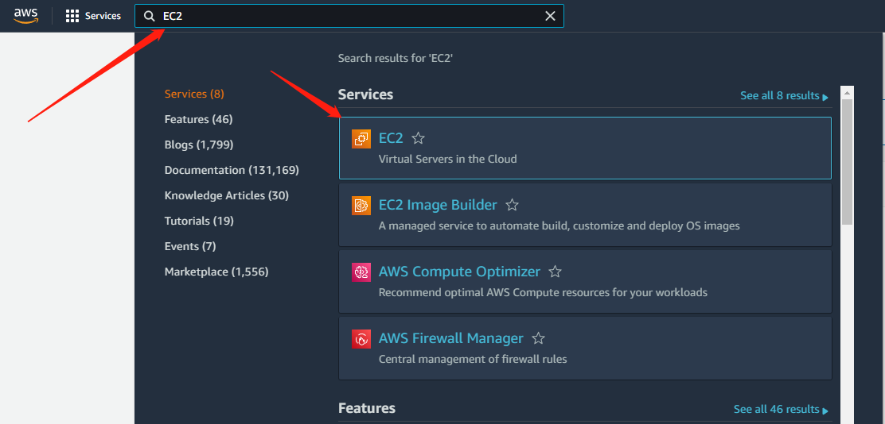
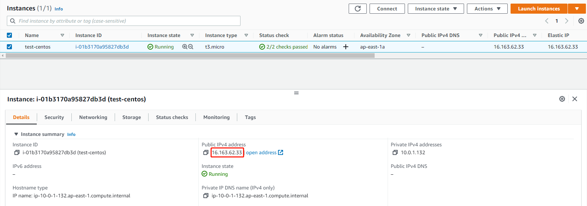

# Connect to EC2

## 1. Select Services -> EC2 buttons.

<figure><figcaption></figcaption></figure>

## 2. Get EC2 information.

<figure><figcaption></figcaption></figure>


Due to geographical restrictions, participating teams from mainland China will have different server addresses.Please pay attention to check the email with  acceleration address information. We recommend that you use the IP address provided by the email.


