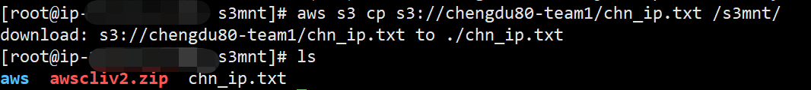

# Obtaining  Data

The competition data and competition questions are stored in the  "s3chengdu80-topic"  S3 bucket, and you can get them in the following ways.

## 1.Log in to the AWS console and download relevant data from the S3 bucket.

1\)In the **Buckets** list, choose the bucket that you want to download objects.

2\)In the object list, check the object you want to download.

3\)Choose **Actions**, then choose **Download**.

4\)Choose “Download” In the **Download objects** dialog box.You've successfully downloaded an object from your bucket.

## 2. Download with AWS CLI command line.

#### [**install & config AWS CLI**](../../service-documents/aws-cli.md)

```text
aws s3 ls（find the bucket and file）
```

 

```text
aws s3 cp s3://chengdu80-project/XXX /local/
```

 

```text
aws s3 cp s3://chengdu80-topic/topic1 ./root/
```

##  3.S3 browser\(Windows\)


Detailed instructions are available on the [S3 browser ](https://s3browser.com/s3browser-first-run.aspx)


##  4.Mount S3 to the system directory\(Linux\)

####  [**install & config AWS CLI**](../../service-documents/aws-cli.md)

#### 4.1 Install goofys

```text
wget https://github.com/kahing/goofys/releases/latest/download/goofys
chmod +x goofys
sudo mv goofys /usr/local/bin/
// centos
sudo yum install -y fuse
// ubuntu
sudo apt install fuse
```

####  4.2 Mount S3

```text
sudo mkdir -p /Mount-Point （挂载文件夹）
sudo chown Your-User-Name:Your-User-Name （系统用户名，如：centos） /Mount-Point
/usr/local/bin/goofys Your-Bucket:Your-School-Prefix （大学简称） /Mount-Point
```

