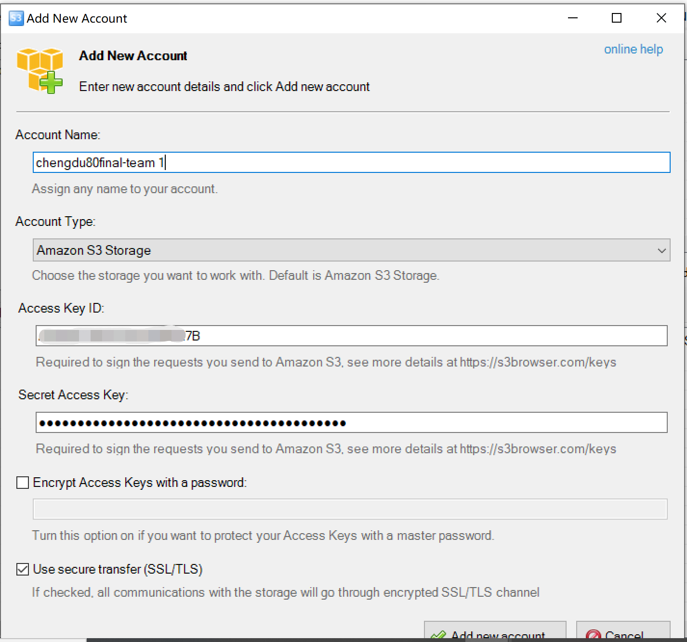

# Video Upload

We use Amazon S3 to upload Project Intro Video after Access to Account \(if you don't know how to access,plz return [Access to Account](../sign-console.md)\).

## Uploading the Intro Video to a bucket 

**Turn to Amazon S3 managerment Console**

a.In the **Bucket** list, choose the name of the bucket that you want to upload your object to.

b.On the **Overview** tab for your bucket, choose **your team folder**.

c.To choose the file to upload, in the **Upload** dialog box, choose **Add files**.

d.Choose a file to upload, and then choose **Open.**

e.Choose **Upload**.

You've successfully uploaded an object to your bucket.

If there are large files on the windows side that cannot be uploaded or downloaded, you can use the official free tool [S3 Browser](https://s3browser.com/download/s3browser-9-2-1.exe).

Install&open the S3 browser,click Account - Add New Account\(Fill in your account key information\)


Detailed instructions are available on the [S3 browser ](https://s3browser.com/s3browser-first-run.aspx)


