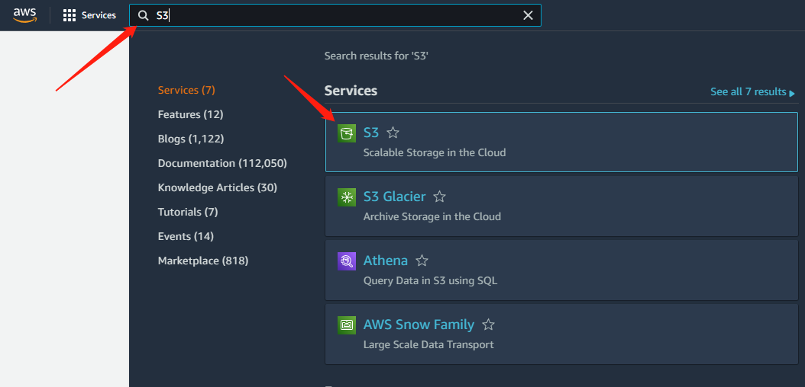
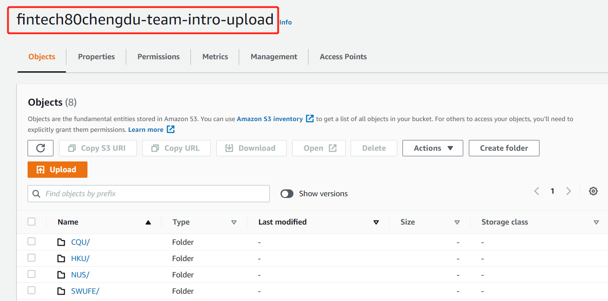
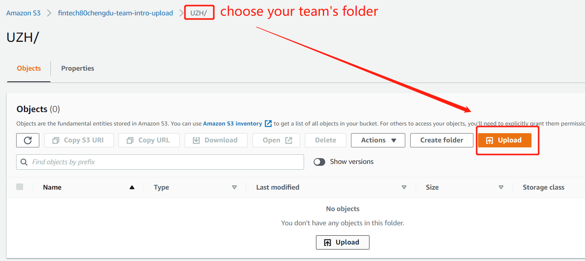
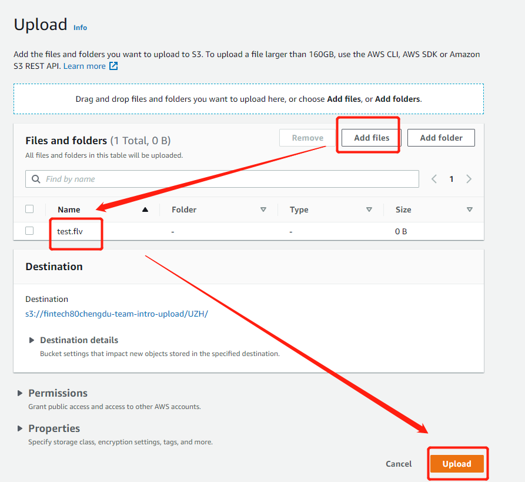
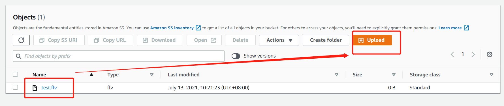
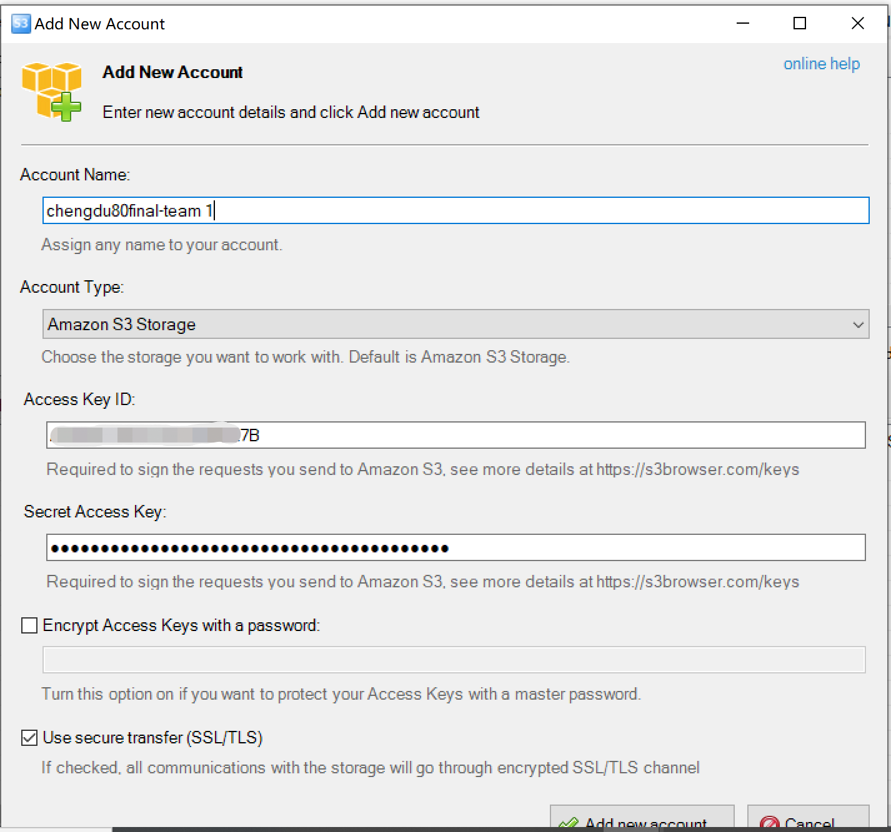

# Project Intro Video and Slides Upload

Please upload the Team Intro Video and Slides to Amazon S3 after logging into your account (if you don't know how to access, plz return [Access to Account](sign-console.md)).

You can upload **project intro video（** **no more than 15mins ）** to the "**fintech80chengdu-video-intro-upload**" S3 bucket and upload **slides** to the "**fintech80chengdu-project-intro-upload**" S3 bucket.&#x20;

<mark style="color:red;">According to the competition rules, teams</mark> <mark style="color:red;"></mark><mark style="color:red;">**on site do not need**</mark> <mark style="color:red;"></mark><mark style="color:red;">to upload project introduction videos, and teams in the online  need to</mark> <mark style="color:red;"></mark><mark style="color:red;">**submit videos**</mark> <mark style="color:red;"></mark><mark style="color:red;">by</mark> <mark style="color:red;"></mark><mark style="color:red;">**10:00 A.M BST on November 11**</mark><mark style="color:red;">.</mark>

### 1.Turn to Amazon S3 management Console.

<figure><figcaption></figcaption></figure>

### 2.In the Bucket list, choose the bucket that you want to upload objects.

<figure><figcaption></figcaption></figure>

### 3.Choose your team folder on the Overview tab.

<figure><figcaption></figcaption></figure>

### 4.Choose the file to upload, in the Upload dialog box, choose Add files.

<figure><figcaption></figcaption></figure>

### 5.Choose Upload.

You've successfully uploaded an object to your bucket.

<figure><figcaption></figcaption></figure>

### 6.When the file is too large.

If there are large files on the windows side that cannot be uploaded or downloaded,  you can use the official free tool [S3 Browser](https://s3browser.com/download/s3browser-9-2-1.exe).

Install\&open the S3 browser, click Account - Add New Account(Fill in your account key information)

<figure><figcaption></figcaption></figure>


Detailed instructions are available on the [S3 browser ](https://s3browser.com/s3browser-first-run.aspx)

