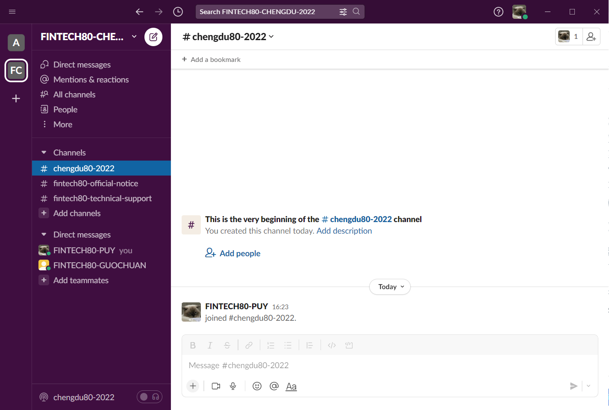

# Support Platform and Specifications

Before testing the environment, please join the Slack workspace of the FINTECH80-CHENGDU competition.You can ask staff information about the competition in this workspace, and you can also contact supporters to solve your problems at any time during the competition.

## Use Slack Platform

Choosing Slack as the platform for technical support and instant notifications (instant messaging, conferences, calls, file management, etc.) for this competition.

### 1.Participants need to click the invitation link to join the Slack workspace of Chengdu80 competiton.

Step 1：Please download the Slack client：

Windows download link：[https://slack.com/intl/en-hk/downloads/windows](https://slack.com/intl/en-hk/downloads/windows)

MAC download link：[https://slack.com/intl/en-hk/downloads/mac](https://slack.com/intl/en-hk/downloads/mac)

Android download link：[https://play.google.com/store/apps/details?id=com.Slack](https://play.google.com/store/apps/details?id=com.Slack)

IOS download link：[https://itunes.apple.com/app/slack-app/id618783545?ls=1\&mt=8](https://itunes.apple.com/app/slack-app/id618783545?ls=1\&mt=8)

Step 2：Please click the [invitation link](https://join.slack.com/t/fintech80chen-g6n8344/shared\_invite/zt-1bzfo4xtg-pLwPzK5z9CfNgnrSfZFJzg) of the Chengdu80@slack workspace.

Step 3：Please use your email account and password to join the workspace of the Chengdu80 competition：

Entering your email account and password, you will receive an email with verification code. After entering the verification code on the web page, there will be a pop-up asking to open your Slack client.  Please select  “Yes”  to join the Slack workspace of the Chengdu80 competition.

### 2.Naming Codes

Please follow the following naming rules for communication. \
&#x20;  \- **Participating team** : Shortname of your university - (team member/instructor) - Personal name \
&#x20;       `eg: SWUFE-TeamMember-LIN`\
&#x20;  \- **Volunteers**: 80 Volunteers - name  - Shortname of the university you assistant  \
&#x20;        `eg: 80Volunteers-LIN-SWUFE`\
&#x20;  \- **Staff**: FINTECH80- Name \
&#x20;        `eg: FINTECH80-IN`

### 3.If you have any questions, you can get help by the following ways:

1\).You can create a private one-to-one chat for communication；

<figure><figcaption></figcaption></figure>

2\).You can also have a public conversation in the corresponding channel to find a solution;

<figure><figcaption></figcaption></figure>
