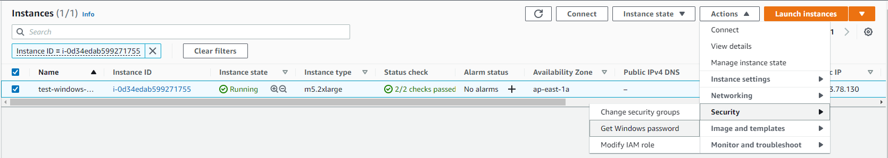

# Connect to Operation System

## 1. Connect to Linux

### **1.1 Windows Connect to Centos7 or Ubuntu18.04 LTS**

(Note:PuTTY is not a designated SSH tool, other login methods are allowed)

Connect using PuTTY

(1).Download and install PuTTY from the [PuTTY download page](http://www.chiark.greenend.org.uk/\~sgtatham/putty/).

(2).Start PuTTY (from the Start menu, choose All Programs, PuTTY, PuTTY).

(3).In the Category pane, choose Session and complete the following fields:

(4).run puttygen.exe,load `.pem`file change to`.ppk` file.

* From the Start menu, choose All Programs, PuTTY, PuTTYgen.
* Under Type of key to generate, choose RSA. If you're using an older version of PuTTYgen, choose SSH-2 RSA.

.png>)

* Choose Load. By default, PuTTYgen displays only files with the extension `.ppk`. To locate your `.pem` file, choose the option to display files of all types.

.png>)

* Select your `.pem` file for the key pair that you specified when you launched your instance and choose Open. PuTTYgen displays a notice that the `.pem` file was successfully imported. Choose OK.
* To save the key in the format that PuTTY can use, choose Save private key. PuTTYgen displays a warning about saving the key without a passphrase. Choose Yes.

&#x20; (5).In the Host Name box: public ip(ipv4).

&#x20; (6).In the Port Name box: 22

&#x20; (7).Select Connection -> SSH -> Auth,browse the `.ppk` file.

.png>)


(Optional) You can configure PuTTY to automatically send 'keepalive' data at regular intervals to keep the session active. This is useful to avoid disconnecting from your instance due to session inactivity. In the **Category** pane, choose **Connection**, and then enter the required interval in the **Seconds between keepalives** field. For example, if your session disconnects after 10 minutes of inactivity, enter 180 to configure PuTTY to send keepalive data every 3 minutes.


Other SSH client please find the information about [SSH Client](https://www.slant.co/topics/149/\~best-ssh-clients-for-windows).

### **1.2 MAC Connect to Linux**

1.open the terminal

.png>)

2.Input the command: ssh -i _key_.pem _username_@_host_

for example:

.png>)

## **2. Connect to Windows**&#x20;

2.1 Open the Amazon EC2 console at [https://console.aws.amazon.com/ec2/](https://console.aws.amazon.com/ec2/).

2.2 Choose EC2 enter the Page.

2.3 Choose Get Windows password.

<figure><figcaption></figcaption></figure>

2.4 Select the file name of the private key (`.pem`) and unzip.

<figure><figcaption></figcaption></figure>

2.5 Copy Password.

<figure><figcaption></figcaption></figure>

2.6 Using Windows mstsc(Remote Desktop Connection) to connect.

.png>)

2.7 Enter the default user name and Password.

.png>)


MAC login:[https://remotedesktopmanager.com/](https://remotedesktopmanager.com/)



**Note**: Get the default user name for the AMI that you used to launch your instance: ‌

For a CentOS AMI, the user name is centos. ‌

For an Ubuntu AMI, the user name is ubuntu. ‌

For a Windows AMI，the user name is administrator.

