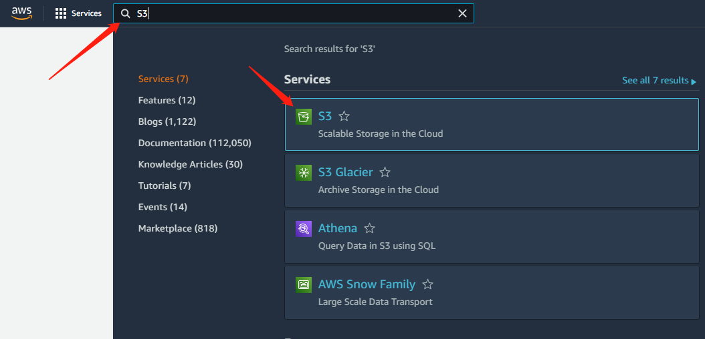

# Test Area

In the pre-match testing session,  you need to do the following tests.&#x20;

1\. verify if the aws console login is working properly and if the team introduction video can be uploaded via S3.&#x20;

2\. check whether the server operating system is correct and whether it can be logged on normally&#x20;

3\. verify that the connection speed to the server is normal and that there is no lag.

## Connect to EC2

### 1.select Services -> EC2 buttons

<figure><figcaption></figcaption></figure>

### 2.get EC2 information

<figure><figcaption></figcaption></figure>


Due to geographical restrictions, participating teams from mainland China will have different server addresses.Please pay attention to check the email with  acceleration address information. We recommend that you use the IP address provided by the email.


## Connect to Operating System

### 1.Connect to Linux

#### **1.1 Windows Connect to Centos7 or Ubuntu18.04 LTS**

(Note:PuTTY is not a designated SSH tool, other login methods are allowed)

Connect using PuTTY

(1).Download and install PuTTY from the [PuTTY download page](http://www.chiark.greenend.org.uk/\~sgtatham/putty/).

(2).Start PuTTY (from the Start menu, choose All Programs, PuTTY, PuTTY).

(3).In the Category pane, choose Session and complete the following fields:

(4).run puttygen.exe,load `.pem`file change to`.ppk` file.

* From the Start menu, choose All Programs, PuTTY, PuTTYgen.
* Under Type of key to generate, choose RSA. If you're using an older version of PuTTYgen, choose SSH-2 RSA.

.png>)

* Choose Load. By default, PuTTYgen displays only files with the extension `.ppk`. To locate your `.pem` file, choose the option to display files of all types.

.png>)

* Select your `.pem` file for the key pair that you specified when you launched your instance and choose Open. PuTTYgen displays a notice that the `.pem` file was successfully imported. Choose OK.
* To save the key in the format that PuTTY can use, choose Save private key. PuTTYgen displays a warning about saving the key without a passphrase. Choose Yes.

&#x20; (5).In the Host Name box: public ip(ipv4).

&#x20; (6).In the Port Name box: 22

&#x20; (7).Select Connection -> SSH -> Auth,browse the `.ppk` file.

.png>)


(Optional) You can configure PuTTY to automatically send 'keepalive' data at regular intervals to keep the session active. This is useful to avoid disconnecting from your instance due to session inactivity. In the **Category** pane, choose **Connection**, and then enter the required interval in the **Seconds between keepalives** field. For example, if your session disconnects after 10 minutes of inactivity, enter 180 to configure PuTTY to send keepalive data every 3 minutes.


Other SSH client please find the information about [SSH Client](https://www.slant.co/topics/149/\~best-ssh-clients-for-windows).

#### **1.2 MAC Connect to Linux**

1.open the terminal

.png>)

2.Input the command: ssh -i _key_.pem _username_@_host_

for example:

.png>)

### **2.Connect to Windows**&#x20;

2.1 Open the Amazon EC2 console at [https://console.aws.amazon.com/ec2/](https://console.aws.amazon.com/ec2/).

2.2 Choose EC2 enter the Page.

2.3 Choose Get Windows password.

<figure><figcaption></figcaption></figure>

2.4 Select the file name of the private key (`.pem`) and unzip.

<figure><figcaption></figcaption></figure>

<figure><figcaption></figcaption></figure>

2.5 Copy Password.

<figure><figcaption></figcaption></figure>

2.6 Using Windows mstsc(Remote Desktop Connection) to connect.

.png>)

2.7 Enter the default user name and Password.

.png>)


MAC login:[https://remotedesktopmanager.com/](https://remotedesktopmanager.com/)


## Test EC2 environment

1.Test the network speed (for example: ping the EC2 IP to test the delay).

2.Check the EC2 environment (OS etc).


Pre-install software is not allowed during the test session.


## Test file uploads and downloads in S3

Open the Amazon S3 console at Services.

**1.Uploading an object to a bucket**

1. In the **Bucket** list, choose the name of the bucket that you want to upload your object to.
2. Click the **Overview** tab for your bucket, choose **Upload** or **Get Started**.
3. To choose the file to upload, in the **Upload** dialog box, choose **Add files**.
4. Choose a file to upload, and then choose **Open.**
5. Choose **Upload**.

You've successfully uploaded an object to your bucket.

**2.Deleting an object**

1. In the **Buckets** list, choose the bucket that you want to delete objects.
2. In the object list, check the object you want to delete.
3. Choose **Actions**, and then choose “Delete ”.
4. &#x20;Confirm the object that you want to delete in the Delete objects dialog box, then select “Delete ”.

&#x20;   You've successfully deleted an object from your bucket.

**3.Downloading an object from a bucket**

1. In the **Buckets** list, choose the bucket that you want to download objects.
2. In the object list, check the object you want to download.
3. Choose **Actions**, then choose **Download**.
4. Choose “Download” In the **Download objects** dialog box.

&#x20;    You've successfully downloaded an object from your bucket.

## Feedback usage

When you have completed the test,  please feedback us [the corresponding test results](https://forms.office.com/Pages/ResponsePage.aspx?id=DQSIkWdsW0yxEjajBLZtrQAAAAAAAAAAAAMAALvGMbNURFozMlhZTEhDRlVFRzUwREVQV09RSkZYMi4u).
