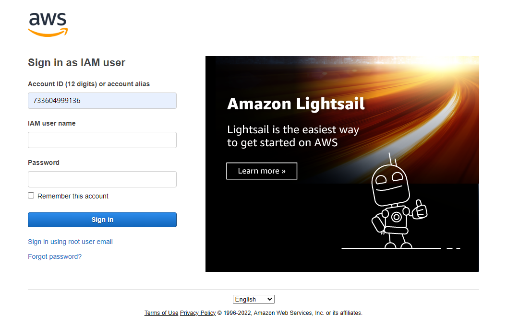

# Access to Account

If this is your first time logging into the AWS console, please follow the steps below.

1.Get account: You will get an email with information about your group account.

2.Open a browser and enter the following sign-in URL.

```markup
https://733604999136.signin.aws.amazon.com/console/
```

3.Enter your IAM user name and password, then choose "**Sign in**".

<figure><figcaption></figcaption></figure>

## &#x20;<a href="#user-sign-in-page" id="user-sign-in-page"></a>
