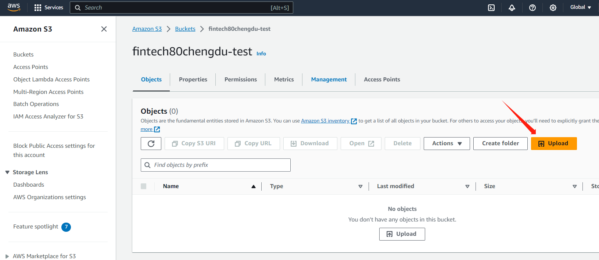
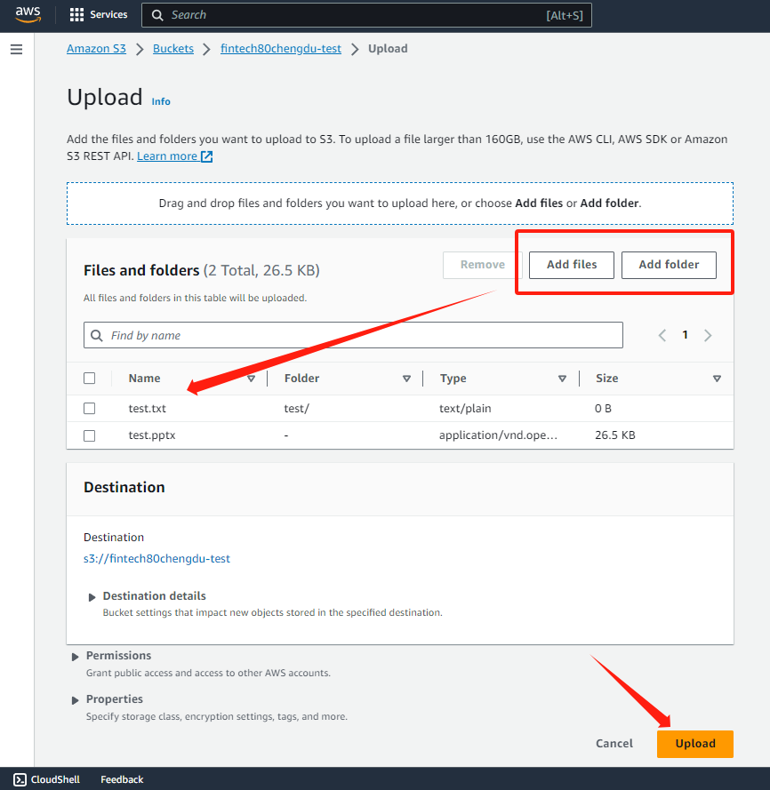
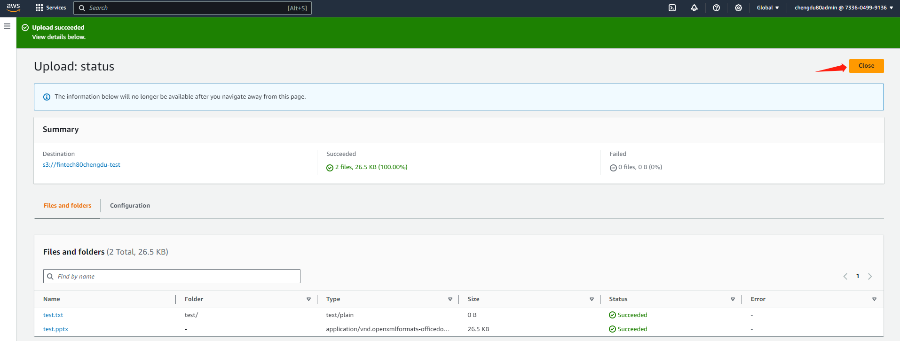
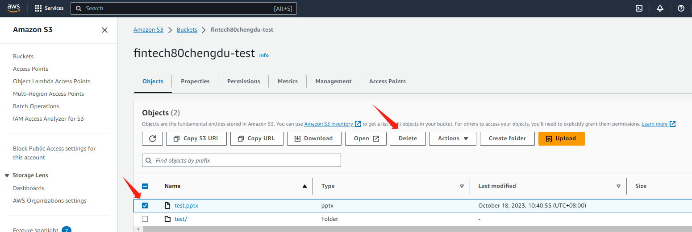
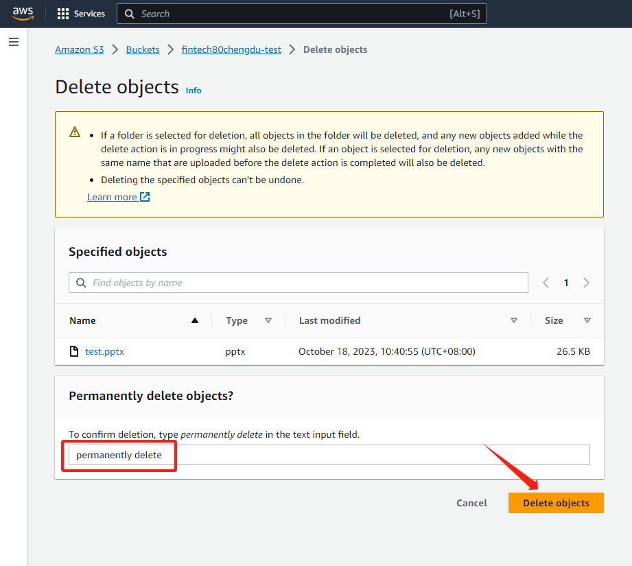
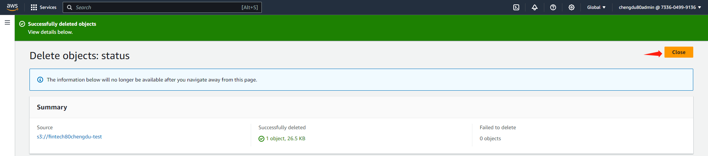
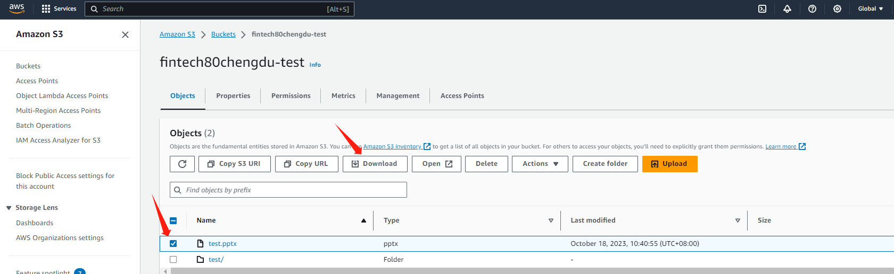

# AWS S3

## Uploading an object to a bucket 

**Amazon S3 managerment Console**

* In the **Bucket** list, choose the name of the bucket that you want to upload your object to.

<figure><figcaption></figcaption></figure>

* On the **Overview** tab for your bucket, choose **Upload** or **Get Started**.

<figure><figcaption></figcaption></figure>

* To choose the file to upload, in the **Upload** dialog box, choose **Add files**.

<figure><figcaption></figcaption></figure>

* Click the **Upload** button to finish uploading**.**

<figure><figcaption></figcaption></figure>

You've successfully uploaded an object to your bucket.

## Delecting an object 

**Amazon S3 managerment Console**

* In the **Buckets** list, choose the name of the bucket that you want to delete an object from.

<figure><figcaption></figcaption></figure>

* In the **Name** list, select the check box for the object that you want to delete,and then choose **Delete**.

<figure><figcaption></figcaption></figure>

* In the **Delete objects** dialog box, verify the name of the object, and type permanently delete.

<figure><figcaption></figcaption></figure>

* Click the **Delete objects** button to complete the deletion

<figure><figcaption></figcaption></figure>

You've successfully deleted an object to your bucket.

## Downloading an object from a bucket 

**Amazon S3 managerment Console**

1. In the **Buckets** list, choose the name of the bucket that you want to download an object from.
2. In the **Name** list, select the check box for the object that you want to download.
3. Click the **Download** button to start the download task.

<figure><figcaption></figcaption></figure>

You've successfully downloaded an object to your bucket.

