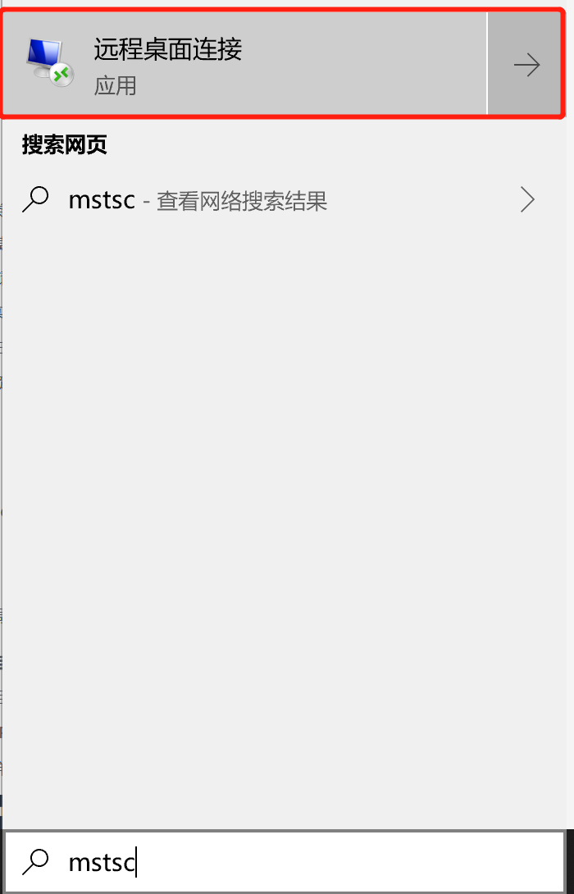

# 虚拟机管理

**Linux:**

**Linux有**[**不同登录方式**](https://docs.aws.amazon.com/zh_cn/AWSEC2/latest/UserGuide/AccessingInstancesLinux.html%20)**，选择一种方式SSH登录。**

注：每个 Linux 实例均使用默认 Linux 系统用户账户启动。默认用户名由启动实例时指定的 AMI 决定。

`对于 Amazon Linux 2 或 Amazon Linux AMI，用户名称是 ec2-user。`

`对于 CentOS AMI，用户名称是 centos。`

`对于 Debian AMI，用户名称是 admin。`

`对于 Fedora AMI，用户名为 ec2-user 或 fedora。`

`对于 RHEL AMI，用户名称是 ec2-user 或 root。`

`对于 SUSE AMI，用户名称是 ec2-user 或 root。`

`对于 Ubuntu AMI，用户名称是 ubuntu。`

**Windows:**

在EC2实例控制台选中所要登录的Windows机器，点击**连接。**

点击弹框中的**获取密码。**

用windows自带的远程连接去连，公网IP在EC2实例控制台上可查看。

输入**公网IP**，**账户**，**密码**进行windows远程登录（windows默认账户为**Administrator**）。

登录完成

